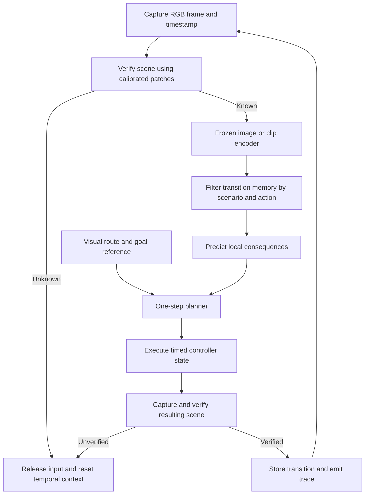

# Cuphead AI

### Visual control, frozen latent memory, and evidence-driven speedrun research

Cuphead AI is an experimental framework for controlling a locally running copy of Cuphead through visual observations and controller input. Its research objective is an autonomous speedrunning system combining learned dynamics, model-predictive planning, fast reactive control, and an offline language-model strategist.

The runnable foundation centers on a **frozen visual encoder, action-conditioned episodic memory, one-step consequence prediction, and visually verified navigation**. Supporting infrastructure includes capture and input backends, demonstration recording, dataset gates, statistical evaluation, optional sequence-model and CUDA experiments, and persistent development orchestration.

**Current evidence supports autonomous navigation into Forest Follies, not an autonomous level clear or completed speedrun.** This document distinguishes implemented mechanisms, measured results, and future work.

<p align="center">
  
</p>

## Contents

- [Research question](#research-question)
- [Implementation status](#implementation-status)
- [Architecture](#architecture)
- [Feature reference and design rationale](#feature-reference-and-design-rationale)
- [Experimental evidence](#experimental-evidence)
- [Setup and reproducible workflows](#setup-and-reproducible-workflows)
- [Evaluation methodology](#evaluation-methodology)
- [Research roadmap](#research-roadmap)
- [Repository guide](#repository-guide)
- [Limitations and scope](#limitations-and-scope)

## Research question

**Can a visually grounded agent improve completion time while controlling failure risk under the latency and data constraints of a real game?** A predictor is useful only when its outputs lead to better actions, arrive before a decision becomes stale, and can be compared against a reproducible baseline.

The motivating observation is that menus and overworld traversal provide repeatable landmarks and reusable action sequences, while combat requires responding to changing hazards. This motivates separate navigation and combat mechanisms. It does not establish that every route is deterministic or all combat variation is random.

Five principles organize the project:

1. **Predict consequences.** Memory should explain what an action did in similar circumstances, rather than only associate a screenshot with a button.
2. **Separate decision timescales.** Route selection, tactical positioning, and immediate reactions have different computational requirements.
3. **Represent missing evidence explicitly.** Unsupported queries return no prediction; unknown screens do not become guessed labels.
4. **Preserve provenance.** Images, input snapshots, timestamps, and experiment records allow failures to be traced to their source.
5. **Measure improvement.** Synthetic correctness, live functionality, and statistically supported performance are different claims.

The [technical plan](docs/SPEEDRUN_PLAN.md) describes the intended program. The [architecture decision record](docs/DECISIONS.md) records context and observations that would reverse decisions. Benefits below are engineering rationale, not claims that every choice has already won an ablation study.

## Implementation status

**Implemented** means a mechanism exists. **Validated** means a specific property has supporting tests or measurements. **Successful** means its defined acceptance criteria have been met. Software behavior can be validated while live-game performance remains unvalidated.

| Area | Available implementation | Evidence boundary |
| --- | --- | --- |
| Capture and control | Windows DXcam/vgamepad; Linux capture/uinput; X11 keyboard paths | Native response and capture exercised; full harness acceptance remains open |
| Demonstrations | Images, normalized actions, raw inputs, timestamps, reviewed metadata | Real footage exists; saved dataset fails training requirements |
| Frozen encoding | Strict V-JEPA loading, CPU INT8, image and clip branches | Inference and navigation exercised; combat usefulness unproven |
| Memory dynamics | Bounded transitions, exact filtering, local predictions | Synthetic tests and small navigation diagnostic; no combat prediction result |
| Navigation | Visual landmarks, route graph, consequence selection | Recorded arrival in playable Forest Follies; no clear |
| T5 sequencing | Frozen backbone with trainable continuous adapters | Optional mechanics tests; no established trained gameplay result |
| CUDA runtime | Graph replay, GPU cosine retrieval, deadline filtering | Implementation available; target-hardware performance remains to be established |
| Evaluation | Event metrics, bootstrap gate, death-rate and stalling checks | Evaluation machinery exists; no successful combat A/B claim |
| Development loop | Persistent tasks, worker/QA separation, preflight, limits | Development automation, distinct from gameplay strategy |
| Full combat architecture | State/event interfaces and reference objective | Learned heads, CEM/MPPI, reflex policy, evaluated LLM strategy pending |

The phase fields in [.ai/project_state.json](.ai/project_state.json) retain the original roadmap and do not enumerate every later experiment. Read dated evidence alongside them. The zero-training navigation bank does **not** require a Cuphead-trained predictor checkpoint; older notes suggesting otherwise were superseded.

## Architecture

### Implemented memory loop



Perception owns observations, memory owns experience, dynamics predicts consequences, planning selects actions, and control owns physical input. The orchestrator connects interfaces and records outcomes. This permits replacing an encoder or testing a planner without embedding device operations inside model code.

### Intended three-timescale controller

| Timescale | Target rate | Responsibility | Present status |
| --- | --- | --- | --- |
| Reflex | 60 Hz | Immediate parry/dash reactions and bounded overrides | Planned |
| Tactical | 15 Hz | Positioning, damage opportunity, risk, short-horizon planning | One-step planner available; full MPC planned |
| Strategic | Offline | Loadouts, route hypotheses, phase priors, failure analysis | Design and interfaces; evaluated strategist pending |

A 60 Hz frame lasts approximately 16.7 ms; a 15 Hz decision interval lasts approximately 66.7 ms. These are design timescales, not achieved CPU-agent rates. Keeping the LLM outside live control prevents variable generation latency from occupying the immediate-reaction path.

## Feature reference and design rationale

### 1. Capture backends and frame integrity

**Source:** [capture.py](src/cuphead/perception/capture.py), [dxcam_capture.py](src/cuphead/perception/dxcam_capture.py), [window_capture.py](src/cuphead/perception/window_capture.py).

Capture returns owned RGB data, dimensions, a delivered-frame index, a monotonic timestamp, and a checksum. Windows selects DXcam; MSS provides an explicit alternative, and Linux retains direct X11 window capture. Backend selection is isolated from inference so faults can be investigated independently.

Owned bytes prevent a reused backend buffer from changing an observation while inference or recording still references it. Monotonic timestamps preserve elapsed-time calculations when the system clock changes. Both protect the observation/action association on which dynamics learning depends.

`IntegrityTracker` checks index continuity and repeated content separately. A counter can advance while pixels remain stale, so indices alone are insufficient. Repeated pixels may also be legitimate during a static menu. Real recording retains and counts repeats rather than treating all identical frames as invalid gameplay.

DXcam waits for a fresh desktop frame and can time out on a static desktop; the default timeout is two seconds. Monitor numbers start at one per GPU, with crops relative to that output. MSS uses desktop coordinates. Delivered indices cannot establish whether the game dropped internal presentations.

**Tradeoff:** copying and checksumming add work but make ownership and integrity inspectable. Neither backend selection nor contiguous indices prove the live latency target has been met.

### 2. Legal actions, controller abstraction, and timed input

**Source:** [action_space.py](src/cuphead/control/action_space.py), [actuator.py](src/cuphead/control/actuator.py), [windows_gamepad.py](src/cuphead/control/windows_gamepad.py), [timed_input.py](src/cuphead/control/timed_input.py).

Control is expressed as held button/axis state with explicit neutral release. Windows uses vgamepad; Linux uses evdev/uinput. The Linux device declares a complete Xbox 360-style signature because creating a generic joystick did not ensure Wine exposed it through the game's controller interface. Enumeration is part of the integration contract.

The combat representation contains **56 legal actions** after applying precedence rules. These remove meaningless aim states and resolve conflicting dash, duck, shooting, and lock combinations. Pruning reduces future search cost and gives demonstrations and policy outputs a shared vocabulary. Assumptions about supported behavior and loadouts must be revisited if observations contradict them.

Timed navigation actions include bindings, hold duration, and release duration in their identity. A brief direction press and a long hold have different outcomes, so treating both as one action would mix incompatible transitions. Separate menu, overworld, and combat candidates keep irrelevant controls out of exploration. An observed pause-menu failure motivated excluding pause from overworld candidates.

Input is released at lifecycle boundaries and during cleanup. The virtual pad should exist before Cuphead launches so the game can enumerate it. Visible response alone does not prove player assignment: a Windows pilot responded through player two.

**Tradeoff:** the normalized combat schema omits EX/super, weapon switching, and menu controls. Raw snapshots preserve those inputs; a future learner needs an explicit schema extension to condition on them.

### 3. Human demonstrations and replay provenance

**Source:** [record_session.py](scripts/record_session.py), [replay.py](src/cuphead/memory/replay.py), [human_input.py](src/cuphead/control/human_input.py), [keyboard_input.py](src/cuphead/control/keyboard_input.py).

The recorder observes human play without selecting actions. It writes normalized actions and the physical-input snapshot from the same poll. Normalizing at collection time produces labels a policy can emit; preserving raw controls retains information removed by pruning. Otherwise a weapon switch could look like unexplained dynamics to a learner receiving only movement and shooting fields.

| Artifact | Purpose |
| --- | --- |
| `frames/*.png` | Lossless RGB observations |
| `actions.jsonl` | Frame-indexed normalized actions |
| `frames.jsonl` | Capture/input times, image paths, checksums, raw input |
| `meta.json` | Level, phase, outcome, build, settings, review status |
| `events.json` | Available event trace without invented labels |
| `hud.jsonl` | Available symbolic HUD observations |

The default gameplay contract is 256 x 256 RGB at 30 FPS, using bilinear stretching. Capture and input times expose sampling skew; short taps between samples may be missed. A 30 FPS recorder does not observe every 60 Hz game frame.

Segments distinguish attempts, menus, and idle footage. Provisional outcomes require review, and full attempts must include their observed ending. Keyboard recording starts after focus acquisition and ends on focus loss. Invalid indices, timestamps, or reader failures prevent silent acceptance of malformed data.

**Why this design:** live demonstrations cost wall-clock time. Preserving controls, timing, and review history lets later experiments reuse that investment without confusing uncertain labels with ground truth. Native Windows recording requires gamepad input; keyboard recording is X11-specific.

### 4. Dataset coverage, integrity, and diversity gate

**Source:** [dataset_gate.py](src/cuphead/evaluation/dataset_gate.py), [check_gameplay_dataset.py](scripts/check_gameplay_dataset.py). Protocol: [GAMEPLAY_DATASET.md](docs/GAMEPLAY_DATASET.md).

The gate validates images, matching action indices, raw input consistency, reviewed labels, and timestamps. It fingerprints audited data including pixels, so a passing result applies to the exact data checked rather than future additions.

Coverage requires at least **100,000 eligible frames**, targeting 200,000, with at least 70% attempt footage, 100 menu frames, 100 idle frames, and five full attempts including two deaths. Clears are reported separately. Synthetic, unreviewed, or invalid segments cannot satisfy coverage. These rules prevent repetitive menus from padding a nominally large combat dataset.

Timing tolerances include at most 5% capture-rate error, no gaps beyond three nominal intervals, at most 1% of intervals longer than 1.5 frames, and input samples no more than one frame late. These are operational tolerances, not exact game-engine synchronization.

The encoder probe samples at least 200 distinct indices, defaulting to 240, across segment strata. It measures mean per-dimension population variance of normalized embeddings for images and consecutive clips, including gameplay-only clips. Separating gameplay prevents varied menus from hiding nearly constant combat representations.

The variance floor, **0.00025602**, is an operational heuristic set to twice an earlier menu-probe value. It is not a universal calibrated collapse threshold. Low variance can reflect homogeneous input, preprocessing errors, or an unsuitable encoder; it identifies an investigation, not its cause.

Both coverage and measured diversity must pass before `training_allowed` and `data_collection_done` become true. Coverage-only audits cannot enable training. This avoids blaming a model architecture for experiments built on inadequate or misaligned data.

### 5. Frozen V-JEPA visual representation

**Source:** [frozen_jepa.py](src/cuphead/perception/frozen_jepa.py). Guide: [FROZEN_LATENT_MEMORY.md](docs/FROZEN_LATENT_MEMORY.md).

The encoder strictly loads upstream V-JEPA 2.1 weights, freezes its parameters, and emits normalized 384- or 768-dimensional latents. The exercised CPU configuration uses the published ViT-B model distilled from ViT-G. Where dimensional compression is needed, the repository uses a seeded fixed random projection; this is distinct from upstream distillation and is not learned locally.

Static navigation uses a 128 x 128 image branch. Combat uses consecutive four-frame clips at 256 x 256. Menus primarily need identity and layout, while moving hazards require temporal information. Separate branches reduce static-scene computation while retaining a temporal experimental path. Context resets across relevant mode changes prevent unrelated scenes from becoming false motion sequences.

CPU dynamic INT8 applies to linear layers; convolution and normalization remain floating point. Unquantized inference on a selected device is a separate configuration. Strict checkpoint loading prevents silent partial initialization, while checkpoint/source/preprocessing/projection fingerprints protect persistent memory from incompatible representation changes.

**Why freeze:** stable embeddings remain comparable across stored experiences and enable navigation before collecting a trainable Cuphead dataset. This isolates how much behavior can be recovered from pretrained features and observed consequences.

**Tradeoff:** visual similarity is not guaranteed to preserve small hazards or damage cues. Pretraining does not supply a combat dynamics model, and CPU clip inference exceeds the tactical budget in historical measurements.

### 6. Bounded episodic transition memory

**Source:** [latent_bank.py](src/cuphead/memory/latent_bank.py).

An experience contains its starting latent, action identity, resulting latent, scenario, observed reward, hit/terminal indicators, frame order, and duration. Default capacity is 4,096 rows, with oldest-row eviction. Atomic persistence avoids partially written banks; loading verifies encoder identity.

Retrieval first filters by exact scenario and action, then searches nearby states within a radius. Runtime scope distinguishes image128 and video256 branches. This prevents similar-looking observations from another scene or preprocessing mode from supplying unrelated consequences.

Dimension, finite-value, frame-order, and duration validation establish the meaning of an experience at the storage boundary. The bank is an inspectable baseline that requires no gradient training and answers what happened after a specific action.

**Tradeoff:** exact filtering reduces irrelevant matches but increases cold starts. FIFO storage bounds memory without preserving rare events by importance. Mature combat data may require retention policies for deaths, phase transitions, and uncommon successful reactions.

### 7. Action-conditioned kNN dynamics

**Source:** [knn_dynamics.py](src/cuphead/world_model/knn_dynamics.py).

`KNNDynamics` defaults to five neighbors within radius 0.25. Each neighbor contributes its observed latent change, applied to the current state. Inverse-distance weights favor nearby evidence:

```text
w_i    = normalize(1 / max(distance(z, z_i), 1e-6))
z_next = sum_i w_i * (z + z_i_next - z_i)
reward = sum_i w_i * observed_reward_i
P(hit) = sum_i w_i * observed_hit_i
P(end) = sum_i w_i * observed_terminal_i
```

Transferring a local change preserves the query's starting point rather than copying a neighbor's destination. This assumes similar states under the same action have comparable transitions, an assumption that weakens outside the observed neighborhood.

Uncertainty combines neighbor distance and disagreement among predicted destinations. The first penalizes extrapolation; the second penalizes inconsistent local evidence. It is a ranking signal, not a calibrated confidence interval.

Unsupported actions return `None`. A confident identity prediction would conflate “nothing happened” with “never observed.” A bank with zero hit examples likewise does not establish combat safety merely because its weighted hit estimate is zero.

### 8. One-step consequence planning and cold starts

**Source:** [memory_planner.py](src/cuphead/planner/memory_planner.py).

The current planner uses:

```text
score = predicted_reward
      + distance(current, goal) - distance(predicted_next, goal)
      - 5.0 * predicted_hit_probability
      - 0.25 * predicted_uncertainty
```

Goal progress is omitted when no goal exists. A designated route action receives priority when supported by local evidence, at or below the default 0.5 hit-probability threshold, and positive-scoring when a goal is supplied.

If predictions are missing, the planner chooses an untried candidate, preferring the designated action when it too is untried. Candidate order therefore matters during exploration. When all actions have predictions, it selects the best score among actions passing the hit filter; if none passes, it scores the full set. This is a practical ranking rule, not a formal safety guarantee.

Runtime rewards already include observed progress, a step penalty, hit penalty, verified-win bonus, and expected-route-transition bonus. The planner separately adds progress and risk terms. The result is a shaped navigation heuristic, not a pure task reward or full speedrun objective.

**Why one step:** action choice remains explainable before introducing accumulated rollout error. Traces retain decision reasons, predicted score, hit probability, uncertainty, and observed prediction error. Full CEM/MPPI planning is separate future work.

### 9. Verified landmarks and breadcrumb routing

**Source:** [landmarks.py](src/cuphead/perception/landmarks.py), [landmark_route.py](src/cuphead/strategist/landmark_route.py), [route manifest](data/landmarks/forest_follies.json).

Calibrated image regions use normalized coordinates, are resized to 64 x 64, and are compared by mean absolute pixel error. Matches must pass their threshold and an ambiguity margin against competitors. Supplemental patches reject superficially plausible matches, such as a shared HP label mistaken for a unique level. Blank references are rejected.

The route graph links verified scenes with short actions. Breadth-first search finds the next edge toward the goal from the currently visible landmark. Observed transitions can extend the graph, allowing re-localization rather than assuming every earlier command succeeded.

Unknown observations release input and reset temporal context. The runtime waits for transitions to settle and avoids storing transitions whose destination remains unverified. Goal/terminal recognition requires repeated observations, three by default. Navigation arrival becomes `goal_reached`, with `cuphead_victory_verified` remaining false.

**Why visual verification:** movement time is an instruction, not evidence of arrival. Loading, collision, focus, and player assignment can invalidate a timed route. Observing the destination closes that loop.

**Tradeoff:** references depend on the calibrated save, English UI, and window setup. Normalized coordinates do not make matching invariant to arbitrary layouts or starting positions. This is calibrated navigation, not general menu understanding.

### 10. Hybrid state, event vocabulary, and risk objective

**Source:** [state schema](src/cuphead/state/schema.py), [event schema](src/cuphead/events/schema.py), [objective.py](src/cuphead/planner/objective.py).

State pairs readable fields such as health, weapon, phase, and cards with a latent vector. Symbols support diagnostics and metrics; latents support flexible prediction. Existing schemas do not themselves provide calibrated general HUD extraction.

Events include phase entry, hits, parries, supers, projectile waves, damage windows, death, knockout, and reflex overrides. Traces compress videos into analyzable sequences for evaluation and eventual strategic reasoning. Their quality depends on the detectors or labels producing them.

The reference tactical objective is:

```text
J = sum_t gamma^t * [aggression * DPS_uptime_t
                    - lambda(hp, phase_progress) * P(hit)_t - 0.05]
    + gamma^H * terminal_value - 0.4 * unspent_cards
```

Default discount is 0.97. Base risk weight interpolates from 0.6 at full health to 12.0 at zero health, then increases with phase progress. Aggression is clamped to [0.1, 2.0]. The intent is to value damage while making hits costlier near failure or after substantial progress. Terminal value accounts for consequences beyond the horizon; time and card penalties discourage inactivity and unused resources.

These constants are reference choices, not combat-tuned results. The objective uses supplied health/phase context rather than independently simulating health evolution, and the memory planner uses its own score. Stalling detection combines low damage uptime with slow completion relative to baseline, reducing false alarms from either signal alone.

General HUD templates and an engineered pink-object prior are planned to provide explicit, inexpensive cues. Their rationale is to exploit predictable visual structure rather than require an encoder to discover everything. Full perception and reflex validation remain open.

### 11. Frozen FLAN-T5 sequence experiment

**Source:** [sequence_model.py](src/cuphead/world_model/sequence_model.py). Guide: [FROZEN_T5_SEQUENCING.md](docs/FROZEN_T5_SEQUENCING.md).

This offline model uses a frozen FLAN-T5 encoder-decoder, defaulting to `google/flan-t5-small`, with three trainable linear adapters. Continuous visual latents and numeric actions enter through embeddings; no tokenizer is required. Observed history conditions causal prediction of future action-dependent latents.

Teacher forcing shifts targets right from the last observed latent, while causal attention prevents future actions/targets leaking into earlier predictions. Rollout encodes context once and feeds predictions back. Masks support nonempty right-padded sequences and exclude padding from attention and loss. Defaults allow 64 context steps and 20 future steps.

The backbone stays frozen and in evaluation mode, but gradients must flow through it to train input adapters. Disabling autograd for the entire backbone path would break that learning signal.

**Research rationale:** test whether pretrained sequence processing can support dynamics through a small trainable interface. Language pretraining does not supply Cuphead physics. Aligned data, held-out autoregressive evaluation, behavioral comparison, and latency measurements are prerequisites to integration. The navigator still uses its existing predictor; no trained T5 gameplay improvement is established.

### 12. Ring-buffered CUDA inference experiment

**Source:** [gpu_recorded_agent.py](src/cuphead/orchestration/gpu_recorded_agent.py). Guide: [CUDA_RECORDED_AGENT.md](docs/CUDA_RECORDED_AGENT.md).

The GPU engine combines frozen encoding with a fixed GPU-resident cosine bank and softmax-weighted action voting. This is a separate retrieval runtime, not the action-conditioned consequence planner accelerated on GPU. Applications must retain scene verification, compatible bank semantics, and controller handling.

The default two-slot ring gives each slot pinned CPU buffers, static GPU tensors, completion/timing events, and a manually captured CUDA graph. Host-to-device, compute, and device-to-host streams coordinate through events. A slot cannot be reused before its previous result is consumed. Separate graph pools prevent another slot from overwriting outputs still being copied.

Preallocation reduces recurring allocation cost; graph replay reduces repeated launch overhead for fixed computation. The bank is normalized once on GPU, and only small retrieval results return to CPU. Exact search costs O(ND), while per-slot storage increases VRAM requirements.

The default deadline is strictly **less than 33 ms**, through CPU observation of completion from submission or the supplied capture timestamp. Late or invalid embeddings suppress action selection, and a full ring rejects new submission immediately. Setup and warmup are excluded from active-loop timing.

**Tradeoff:** queued work can increase latency even when throughput improves. Static shapes require separate image/clip engines. CUDA graphs neither guarantee deadlines nor prove physical transfer/compute overlap; those require target-hardware measurements under game contention. The benchmark uses synthetic clips and a random bank even when loading actual V-JEPA weights.

### 13. Latency canaries and independent video recording

**Source:** [latency.py](src/cuphead/evaluation/latency.py), [latency_canary.py](scripts/latency_canary.py), [video_recorder.py](src/cuphead/perception/video_recorder.py).

The canary measures actuation to visible response, which differs from capture FPS or model duration. A fast encoder is insufficient when input reaches the game late or observations are stale. Harness targets are p50 <30 ms and p99 <50 ms over 200 real trials, plus a separate ten-minute capture-integrity criterion.

Synthetic mode tests measurement plumbing, not native responsiveness. The CUDA inference deadline likewise does not replace an input-to-visible-response experiment.

Video recording runs independently from inference with actual capture timestamps in a sidecar. Windows uses a separate MSS source to avoid sharing the agent's DXcam instance. AVI playback has a fixed rate, so timestamps are needed to inspect gaps. Smooth playback is not timing evidence, and existing navigation recordings contain no audio.

### 14. Persistent development orchestration

**Source:** [state_store.py](src/cuphead/orchestration/state_store.py), [tasks.py](src/cuphead/orchestration/tasks.py), [preflight.py](scripts/preflight.py), [babysitter_loop.py](scripts/babysitter_loop.py).

Four `.ai/` documents retain project state, task dependencies, agent status, and failures. Atomic replacement prevents interruption from exposing partially written JSON. Persistent tasks carry acceptance criteria and survive individual model invocations.

Preflight checks state, agent definitions, task graph, Git baseline, Claude CLI capabilities, and tests. The loop selects eligible work, invokes its worker, requests separate QA acceptance, records the result, and can commit accepted changes. Iteration limits, per-invocation budget controls, timeouts, and repeated-failure stops bound execution. It refuses a dirty starting tree.

The six development roles are architect, vision, world-model, data, QA, and babysitter. They are not six gameplay processes. The implementing worker does not grade its own work: separate QA tests acceptance and preserves disagreements as failures.

**Why a standard-library foundation:** diagnostic and orchestration logic should remain usable before ML/native integrations are installed. Optional integrations load dependencies separately. This makes missing infrastructure diagnosable without requiring the complete research environment to work first.

## Experimental evidence

These are historical artifacts, not newly repeated benchmarks. Hardware, save state, capture backend, and preprocessing constrain interpretation.

| Evidence | Recorded observation | Supported conclusion |
| --- | --- | --- |
| [Boot navigation](experiments/boot_to_forest_follies.json) | Frozen-encoder boot-to-playable-level route | Calibrated navigation executed; victory false |
| [Preflight 04 verification](experiments/v1_gamepad_recorded_04.verification.json) | 425 decoded frames, 20 FPS playback, 21.25 s, increasing capture times | Inspectable navigation recording; no combat clear |
| [V1 state audit](experiments/v1_state_audit.json) | Seven navigation transitions after freezing 16 rows: mean predicted cosine 0.996857 versus no-change 0.962361 | Small local prediction diagnostic; no combat/hit/terminal coverage |
| [Dataset audit](experiments/gameplay_dataset_gate.json) | 3,640 eligible frames: 2,881 attempt, 759 menu, zero idle; two full attempts, zero clears | Insufficient training coverage |
| [Diversity probe](experiments/gameplay_dataset_gate.json) | Image variance about 0.000143183; clip variance about 0.000130838; floor 0.00025602 | Operational diversity gate failed |
| [Windows pilot](experiments/windows_capture_pilot_20260917.json) | 1,628 verified images at about 19.60 FPS; visible controller response | Native plumbing exercised; player-two assignment excludes single-player training |

The [CPU memory guide](docs/FROZEN_LATENT_MEMORY.md) reports approximately 46 ms median image128 inference and 300 ms video256 inference while Cuphead was running. Clip inference exceeds the intended 66.7 ms tactical interval. It motivates optimization experiments but does not demonstrate that CUDA resolves the bottleneck.

A recording initially named `root_pack` was identified as Forest Follies during review. The original directory is preserved, and [the segmentation record](experiments/gameplay_segmentation_20260915.json) supplies corrected labels. Reviewed content takes precedence over historical filenames.

## Setup and reproducible workflows

Run commands from the repository root. Python 3.11 is a practical baseline for this checkout. Scripts add `src/` to their import path; direct imports require `src/` on `PYTHONPATH`. Requirements specify version ranges rather than a complete lock, so retain resolved versions with results.

### Windows environment

```powershell
python -m venv .venv
.venv\Scripts\python.exe -m pip install -r requirements.txt
```

Install `requirements-memory.txt` for pretrained encoding and `requirements-sequence.txt` for T5. V-JEPA source and checkpoint are separate assets; follow the pinned revision and checksum in [the memory guide](docs/FROZEN_LATENT_MEMORY.md). Installation alone does not provision them.

vgamepad requires its ViGEmBus driver. The Windows game source uses the primary monitor; run Cuphead fullscreen there. Create the virtual pad before launch:

```powershell
.venv\Scripts\python.exe scripts/launch_with_vgamepad.py -- "C:\GOG Games\Cuphead\Cuphead.exe"
```

Replace the executable path with your installation. A runner using its own `--launch` option creates its own controller; avoid creating an additional competing virtual pad.

### Hardware-free checks

```powershell
python -m unittest discover -s tests -v
python scripts/latency_canary.py --synthetic
python scripts/record_session.py --synthetic --frames 300
python scripts/run_memory_agent.py --synthetic --bank data/memory/readme_fixture.json
```

Optional dependency/hardware tests may skip; report skips with passes. Synthetic commands write diagnostic artifacts but cannot establish real dataset coverage or game victory. Keep fixture banks separate from real navigation banks.

### Calibrated Windows navigation

After provisioning memory dependencies and encoder assets:

```powershell
.venv\Scripts\python.exe scripts/run_memory_agent.py --real --controller gamepad --navigation-only --route data/landmarks/forest_follies.json --bank data/memory/navigation.json --max-seconds 90 --max-steps 500 --launch "C:\GOG Games\Cuphead\Cuphead.exe"
```

References must match the observed UI and save setup. `--navigation-only` stops at the route goal. Add `--record-video experiments/navigation_review.avi` before `--launch` for independent video evidence. Keep `--launch` and its game command last because it consumes all remaining arguments. Omitting `--launch` attaches to an existing game subject to controller enumeration and capture setup.

Linux/Wine retains an explicit `--controller keyboard` X11 fallback and the controller route. Historical Linux backend constraints appear in [the memory guide](docs/FROZEN_LATENT_MEMORY.md); they do not establish Windows behavior.

### Demonstration collection and audit

Native Windows physical-gamepad recording:

```powershell
.venv\Scripts\python.exe scripts/record_session.py --real --input-source gamepad --segment-type attempt --boss forest_follies --phase whole_attempt --fps 30 --width 256 --height 256 --max-seconds 300 --label-after
```

Linux/X11 supports `--input-source keyboard`. Record menu and idle segments separately; preserve attempts through their observed ending. The human recorder reads physical controls and does not require an agent-output virtual pad.

```powershell
.venv\Scripts\python.exe scripts/check_gameplay_dataset.py audit --root data/replays --boss forest_follies --width 256 --height 256 --fps 30 --samples 240 --output experiments/gameplay_dataset_gate.json
```

The full audit needs encoder assets and actual replay images. Versioned metadata cannot reproduce image/diversity checks because raw recording frames are excluded from Git. Failed audits exit 2. Follow [the collection protocol](docs/GAMEPLAY_DATASET.md) for labeling and interpretation.

The separate [Windows exploration pilot](docs/WINDOWS_CAPTURE_PILOT.md) uses seeded untrained actions and a command-file setup flow. Its raw format requires segmentation and review; it is not a reviewed human replay or trained policy.

### Optional experiments

```powershell
# Requires memory dependencies and pretrained assets.
.venv\Scripts\python.exe scripts/run_memory_agent.py --benchmark

# Requires optional sequence dependencies to execute rather than skip.
.venv\Scripts\python.exe -m unittest discover -s tests -p test_sequence_model.py -v

# Requires compatible CUDA hardware and PyTorch; tiny synthetic encoder.
.venv\Scripts\python.exe scripts/run_gpu_recorded_agent.py --no-compile
```

The compiled GPU path additionally needs a supported compiler/Triton environment. Consult [CUDA setup and validation](docs/CUDA_RECORDED_AGENT.md) for opt-in tests and profiling, and [T5 sequencing](docs/FROZEN_T5_SEQUENCING.md) for adapter APIs. These commands imply no validated combat training result.

### Development-loop inspection

```powershell
python scripts/preflight.py
python scripts/babysitter_loop.py --once --dry-run
```

Preflight requires Git and the expected Claude CLI in addition to the test foundation. Removing `--dry-run` performs worker/QA work and can create commits. Longer runs accept `--max-iterations` and `--max-budget-usd`; model calls may incur cost. See [CLAUDE.md](CLAUDE.md) for the development contract.

## Evaluation methodology

[metrics.py](src/cuphead/evaluation/metrics.py) derives results from event traces; [gates.py](src/cuphead/orchestration/gates.py) compares baseline and candidate.

| Criterion | Default acceptance | Reason |
| --- | --- | --- |
| Sample count | At least 30 attempts per arm | Reduce dependence on isolated favorable runs |
| Speed | Lower candidate median TTK | Test the completion-time objective |
| Bootstrap | 10,000 resamples; 95% interval for candidate-minus-baseline median entirely below zero | Require improvement to survive resampling |
| Reliability | Death-rate increase <=0.05 | Expose faster surviving runs purchased with more failures |
| Stalling | Detector does not fire | Reject avoidance masquerading as improvement |
| Latency | Candidate p99 within supplied budget | Preserve operational usefulness |

Deaths contribute to attempts and death rate but are excluded from successful-clear TTK. Inventing completion times for deaths would change the statistic's meaning. High failure rates can still bias the surviving-clear sample; the architecture record identifies expected time including reset cost as a possible future primary metric.

The gate checks latency only when both a budget and candidate latency are provided, and the caller supplies the stalling result. A passed verdict with omitted latency is therefore not evidence of real-time control. Experiments must explicitly provide the measurements needed for their claim.

Record build, difficulty, level, loadout, hardware, dependencies, capture settings, encoder fingerprint, bank identity, action schema, random seeds, outcomes, and timing summaries. Preserve successful-clear count as well as total attempts. Navigation, inference, dataset, and combat experiments have separate acceptance criteria.

### Proposed ablations

These are research questions, not completed findings:

| Comparison | Question | Measurements |
| --- | --- | --- |
| Verified route vs timed route | Does re-localization improve reliability? | Arrival rate, unknown stops, time |
| Consequence planner vs nearest-action retrieval | Does action conditioning improve decisions? | Prediction error, hits, repeated task success |
| kNN vs trained T5 | Does sequencing generalize beyond local memory? | Autoregressive error, behavior, latency |
| Full vs reduced precision | What changes with quantization? | Neighbor/action agreement, median/p99 timing |
| Radius/uncertainty ablations | Does rejection reduce harmful extrapolation? | Unsupported queries, error, failures |
| One vs multiple GPU slots | Does overlap help under game contention? | Tail latency, misses, throughput, VRAM, profiler trace |

Latent similarity is diagnostic, not the final objective. The planned combat gate requires held-out hit-prediction AUC >=0.85 at eight steps per boss, followed by actual planner improvement. Strong navigation similarity cannot substitute for hazard prediction or repeated clears.

## Research roadmap

Existing experimental branches do not establish that earlier phase gates have passed.

| Stage | Remaining work | Exit evidence |
| --- | --- | --- |
| Harness | Live response and sustained capture validation | p50 <30 ms, p99 <50 ms over 200 trials; ten-minute integrity run |
| Perception | HUD, event detection, explicit parry cues | Correct HP/cards on 5,000 held-out frames; event F1 >=0.95 |
| Baseline | Repeated target-boss attempts | 30-attempt TTK distribution; CI width <15% of median |
| Reflex | Immediate parry/dash behavior and arbitration | Human-median parry conversion; override precision >=0.90 |
| Learned dynamics | Action-conditioned combat model | Per-boss eight-step hit AUC >=0.85 |
| MPC | CEM/MPPI, value/prior heads, rollout search | Statistical improvement; planning <=10 ms |
| Strategist | Typed hypotheses and event-based post-mortems | Three evaluated improvements; prediction calibration |
| Full route | Generalization and segment assembly | Verified full-run results and tracked splits |

The intended decoder-free dynamics model prioritizes control-relevant prediction over reconstructing background pixels. Planned MPC searches short sequences and executes only the first action before replanning, limiting accumulated error. A policy prior and later distillation are intended to reduce search cost. These mechanisms require implementation and comparison against simpler baselines.

Strategic proposals must include bounded parameters and numeric predictions that enter evaluation before acceptance. The immediate evidence bottlenecks are diverse valid gameplay data, calibrated combat outcomes, and timing under the actual game workload.

## Repository guide

```text
cuphead-ai/
|-- README.md                 Research overview and workflows
|-- CLAUDE.md                 Engineering and acceptance contract
|-- requirements*.txt         Base and optional dependencies
|-- docs/                     Designs, protocols, historical notes
|-- .ai/                      Persistent project/task/agent/failure state
|-- .claude/agents/            Development-agent definitions
|-- experiments/              Results, traces, and evidence
|-- data/
|   |-- landmarks/            Calibrated images and route manifest
|   |-- recordings/           Historical metadata; raw frames local
|   |-- replays/              Local demonstration and fixture output
|   `-- memory/               Local persistent latent banks
|-- scripts/                  Runners, recording, audits, orchestration
|-- src/cuphead/
|   |-- perception/           Capture, encoders, verification, video
|   |-- state/                Symbolic/latent state interfaces
|   |-- events/               Event vocabulary and trace operations
|   |-- control/              Actions, devices, execution, input readers
|   |-- memory/               Replays and transition memory
|   |-- world_model/          kNN dynamics and optional T5
|   |-- planner/              One-step planner and risk objective
|   |-- policy/               Reserved reflex-policy architecture
|   |-- strategist/           Route graph and strategic architecture
|   |-- evaluation/           Metrics, dataset gate, latency
|   `-- orchestration/        Runtime integration, GPU engine, state
`-- tests/                    Logic, integration, optional ML tests
```

| Document | Focus |
| --- | --- |
| [SPEEDRUN_PLAN.md](docs/SPEEDRUN_PLAN.md) | Target architecture and staged program |
| [DECISIONS.md](docs/DECISIONS.md) | Rationale and reversal conditions |
| [FROZEN_LATENT_MEMORY.md](docs/FROZEN_LATENT_MEMORY.md) | Encoder provisioning and navigation |
| [FROZEN_T5_SEQUENCING.md](docs/FROZEN_T5_SEQUENCING.md) | Causal sequence API and training mechanics |
| [CUDA_RECORDED_AGENT.md](docs/CUDA_RECORDED_AGENT.md) | GPU ownership, deadlines, benchmarks |
| [GAMEPLAY_DATASET.md](docs/GAMEPLAY_DATASET.md) | Replay schema, review, coverage, diversity |
| [WINDOWS_CAPTURE_PILOT.md](docs/WINDOWS_CAPTURE_PILOT.md) | Native collection and exclusions |
| [V1_PROGRESS.md](docs/V1_PROGRESS.md) | Historical execution; read its opening correction before older prerequisite claims |

## Limitations and scope

No autonomous combat clear, speedrun result, trained reflex policy, or statistically validated gameplay improvement is established. The transition bank supplies local evidence, not a globally reliable game model. Calibrated references constrain navigation portability, and excluded raw frames/checkpoints prevent a fresh checkout from reproducing every historical measurement without additional assets.

Reward weights, action-pruning assumptions, diversity thresholds, and timing targets are explicit research choices. Their presence makes experiments inspectable, not necessarily optimal. Dependency ranges and machine-specific historical measurements also limit exact reproduction unless resolved environments are retained.

The project targets single-player, offline operation on a legitimately owned local copy of Cuphead. Game assets, pretrained checkpoints, and upstream model code are separate dependencies; this documentation does not grant rights to those materials.
